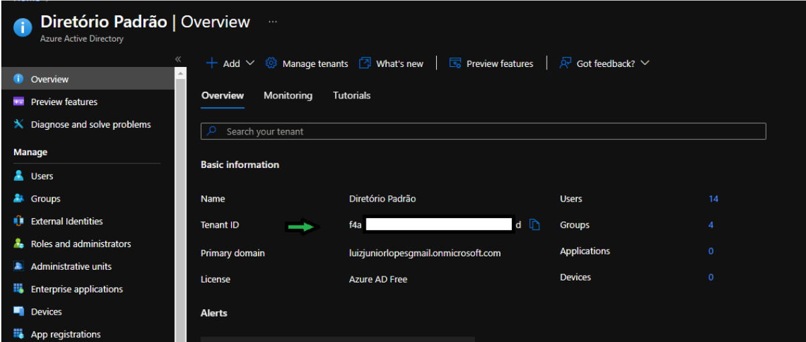
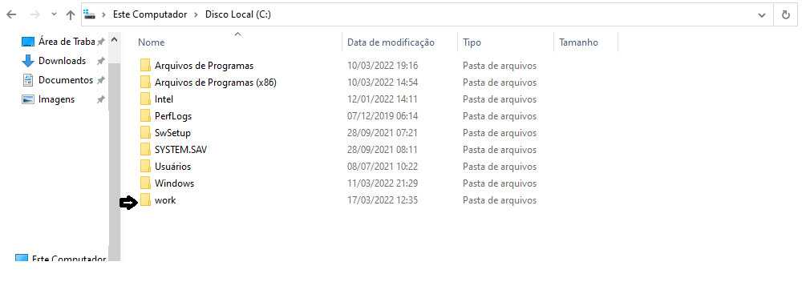
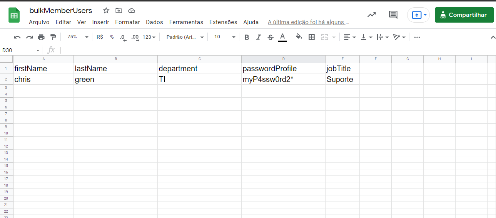
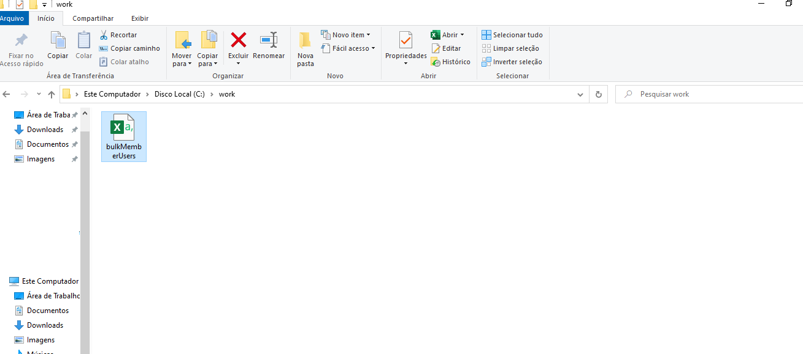
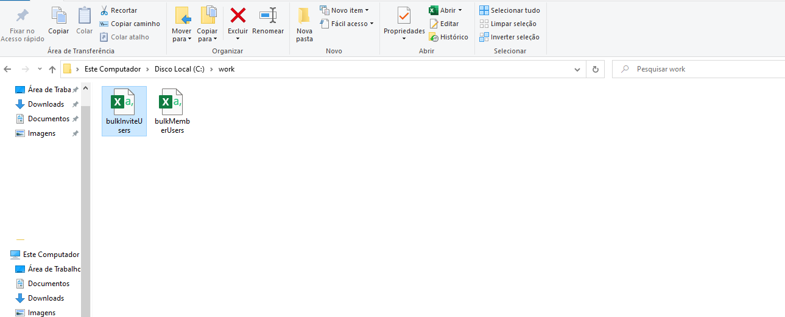

# Lab 1.4 - Criação de usuários membros e convidados em massa usando o powershell

## Instalando PowerShell para Azure AD no PC Local

### Abra o powershell como administrador

Execute o comando a seguir:


 **powershell** 
  ```powershell
   Install-Module AzureAD
   ```

### Conectando ao Azure AD pelo powershell

Execute o comando a seguir:


 **powershell** 
  ```powershell
   Connect-AzureAD -TenantID <digite o ID do tenant>
   ```
 **Exemplo** 
  ```powershell
   Connect-AzureAD -TenantID 11a11a11-1aa1-a11a-11a1-1111a1111a11
   ```

**Obs:** O valor do Tenant ID é encontrado dentro do seu diretório do Azure AD no portal. Se não colocar o tenant ID pode ocorrer erro de autorização na hora de executar os cmdlets.




### Criando usuário membro em massa com o PowerShell

No seu computador local crie uma pasta no diretório C: chamada “work”.



Crie um arquivo na plataforma que quiser em forma de planilha e a configure como a imagem abaixo:



Edite os campos com as informações dos usuários que irão ser criados. Edite o nome do arquivo como na figura acima(esse nome pode ser qualquer um de sua escolha). Após os campos preenchidos, baixe o arquivo no formato .csv e insira o arquivo na pasta “work” criada anteriormente.



Volte ao powershell.


Execute o comando a seguir:


 **powershell** 
  ```powershell
   #Insere o caminho do seu .csv para uma variável. Verifique se o caminho está igual ao seu, caso não esteja coloque o caminho correto do seu arquivo.
   $CsvFilePath = "C:\work\bulkMemberUsers.csv"

   #Importa o csv
   $NewUsers = import-csv -Path $CsvFilePath

   #insere o primary domain do seu diretório para uma variável. Edite esse campo com o seu.
   $directory = "contoso.com"

   # O comando “Foreach” irá passar por todos os usuários do seu csv, para que possam ser criados.
   Foreach ($NewUser in $NewUsers) { 

      $PasswordProfile = New-Object -TypeName Microsoft.Open.AzureAD.Model.PasswordProfile

      $PasswordProfile.Password = $NewUser.passwordProfile

      #A variável abaixo irá compor as informações do “UserPrincipalName”
      $UPN = $NewUser.firstName + "." + $NewUser.lastName + "@" + $directory
      $UPN = $UPN.ToLower

      $DisplayName = $NewUser.firstName + " " + $NewUser.lastName + " (" + $NewUser.department + ")"

      $MailNickName = $NewUser.firstName + "." + $NewUser.lastName


      New-AzureADUser -UserPrincipalName $UPN -AccountEnabled $true -DisplayName $DisplayName `
      -GivenName $NewUser.FirstName -MailNickName $MailNickName -Surname $NewUser.LastName `
      -Department $Newuser.Department -JobTitle $NewUser.jobTitle -PasswordProfile $PasswordProfile


    }

   ```

**Obs:** Após a execução bem-sucedida desse script, os novos usuários serão criados em seu Azure Active Directory. Uma vez que especificamos -AccountEnabled = $True, os novos usuários podem usar imediatamente sua senha para entrar no diretório. Se você não quiser que as contas de usuários fiquem ativas diretamente após a execução do script, especifique -AccountEnabled = $False e habilite as contas posteriormente usando o cmdlet Set-AzureADUser.


### Criando usuário convidado em massa com o PowerShell

Crie um arquivo na plataforma que quiser em forma de planilha e a configure como a imagem abaixo:


Edite os campos com as informações dos usuários que irão ser criados. Edite o nome do arquivo como na figura acima(esse nome pode ser qualquer um de sua escolha). Após os campos preenchidos, baixe o arquivo no formato .csv e insira o arquivo na pasta “work” criada anteriormente.



Volte ao powershell.

Execute o comando a seguir:


 **powershell** 
  ```powershell
 #Insere o caminho do seu .csv para uma variável. Verifique se o caminho está igual ao seu, caso não esteja coloque o caminho correto do seu arquivo.
   $CsvFilePath = "C:\work\bulkInviteUsers.csv"

   #Importa o csv
   $NewGuestUsers = import-csv -Path $CsvFilePath

   # O comando “Foreach” irá passar por todos os usuários do seu csv, para que possam ser criados.
   Foreach ($NewGuestUsers in $NewGuestUsers) { 

   $invitedUserDisplayName = $NewGuestUsers.invitedUserDisplayName 
   $invitedUserEmailAddress = $NewGuestUsers.invitedUserEmailAddress

   $inviteRedirectUrl = $NewGuestUsers.inviteRedirectUrl

   New-AzureADMSInvitation -InvitedUserDisplayName $invitedUserDisplayName -InvitedUserEmailAddress $invitedUserEmailAddress -SendInvitationMessage $True -InviteRedirectUrl $inviteRedirectUrll
   ```


#### Revisão

Nesse laboratório, você aprendeu:

+ Instalar Módulo PowerShell Azure AD no PC Local
+ Conectar ao Azure AD pelo powershell
+ Criar usuários membro da sua organização em massa com o PowerShell
+ Criar usuários convidado em massa com o PowerShell


#### Referências

+ https://docs.microsoft.com/pt-br/powershell/azure/active-directory/importing-data?view=azureadps-2.0
+ https://docs.microsoft.com/pt-br/azure/active-directory/external-identities/bulk-invite-powershell
