# Lab 1.1 - Configurando Azure AD Connect

# Task 1: Criar a máquina virtual 
1. Entre no portal do Azure: **https://portal.azure.com**

2. Selecione a aba **All resources** no menu do portal, procure e selecione **Virtual Machines**, clique em **+Create** e escolha **Azure Virtual Machine** no menu suspenso. Clique em **Create**.

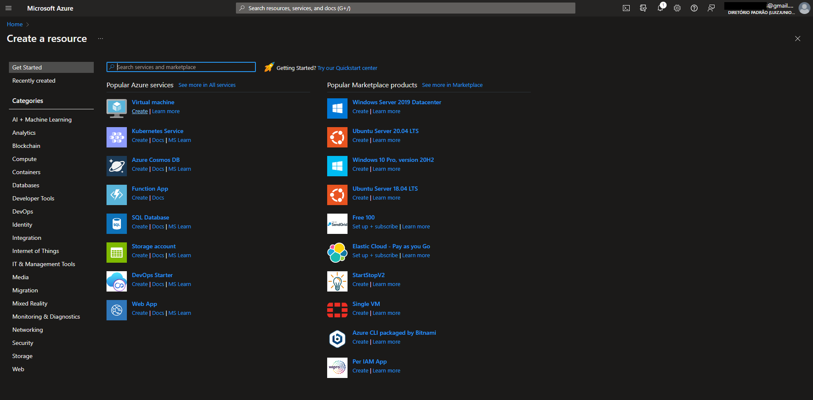

3. Na aba **Basic**, preencha às seguintes informações (deixe os padrões para todo o resto):

   | Configurações                    | Valores                                   |
   |  --                              | --                                        |
   | Subscription                     | **Use o padrão fornecido**                |
   | Resource Group                   | **Criar um novo grupo de recursos**       |
   | Virtual Machine Name             | **vmADConnect**                           |
   | Region                           | **(US) East US**                          |
   | Availability                     | **No infratructure redundancy required**  |
   | Image                            | **Windows Server 2019 Datacenter - Gen2** |
   | Size                             | **Standard D2s v3**                       |
   | username                         | **adminseunome**                          |
   | password (digite com atenção!)   | **Pa$$w0rd1234**                          |
   | Inbound rules -                  |**Allow selected ports**                   |
   | Allow selected ports             | **RDP (3389)**                            | 

 

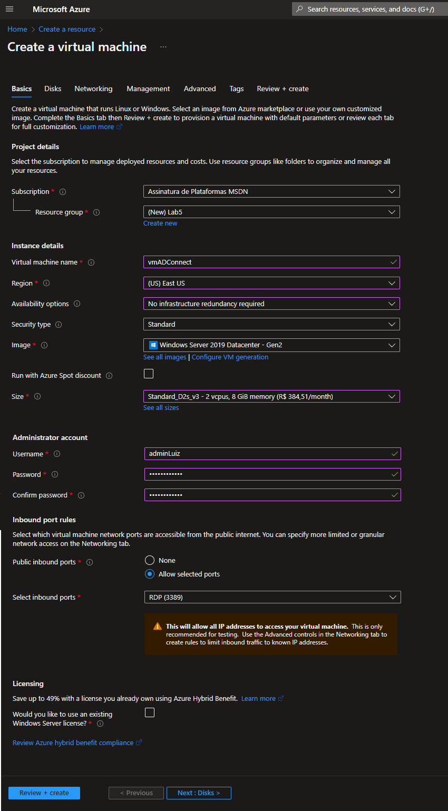

4. Alterne para a guia **Management**, e defina a seguinte configuração:

   | Configurações | Valores |
   | -- | -- |
   | Boot diagnostics | **Disable**|
   | Enable auto-shutdown | **Disable**|
    


5. Deixe os valores restantes nos padrões e clique no botão **Review and Create** na parte inferior da página.

6. Depois que a validação for aprovada, clique no botão **Create**. Pode levar de dois a cinco minutos para implantar a máquina virtual.

7. Você receberá atualizações na página de implantação e na área **Notifications** (o ícone de sino na barra de menu superior).


# Tarefa 2: Conecte-se à máquina virtual

Nesta tarefa, conecte a nova máquina virtual usando RDP (Remote Desktop Protocol).

1. Clique no ícone de sino na barra de ferramentas azul superior e selecione **Go to resource** quando sua implantação for bem-sucedida.

    >**Nota**: Você também pode usar o link **Go to resource** na página de implantação

2. No aba **Overview** da máquina virtual, clique no botão **Connect** e escolha **RDP** na lista suspensa.

    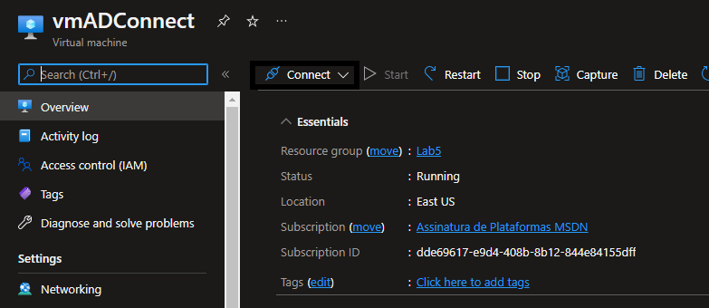

    ****Nota****: as instruções a seguir informam como se conectar à sua VM a partir de um computador Windows. Em um Mac, você precisa de um cliente RDP como este Remote Desktop Client da Mac App Store e em um computador Linux você pode usar um cliente RDP de código aberto.

3. No aba **Connect** da máquina virtual, mantenha as opções padrão para conectar-se ao endereço IP público pela porta 3389 e clique em **Download RDP File**. Um arquivo será baixado no canto inferior esquerdo da tela.

4. **Abra** o arquivo RDP baixado (localizado na parte inferior esquerda de sua máquina de laboratório) e clique em **Connect** quando solicitado.

    

5. Na janela **Segurança do Windows**, entre usando as credenciais de administrador usadas ao criar sua VM **adminseunome** e a senha **Pa$$w0rd1234**.

6. Você pode receber um certificado de aviso durante o processo de entrada. Clique em **Sim** ou para criar a conexão e conectar-se à sua VM implantada. Você deve se conectar com sucesso.

    

Uma nova máquina virtual (vmADConnect) será iniciada dentro do seu laboratório. 

# Task 3: Criar Domain Controller

1. No Gerenciador do Servidor, selecione **Add roles and features**, a janela abaixo será aberta.

 

2. Selecione **Next** até a aba **Server and Roles**. Nas role selecione a opção **Active Diretory Domain Services**

 

3. Uma nova janela será aberta. selecione **Add Features**.


4. Clique em **Next** até a aba **Confirmation**. Marque a caixa **Restart the destination server automatically**,e clique **Yes** na janela de confirmação. Em seguida, selecione o botão **Install**


5. Aguarde a finalização da instalação do recurso.

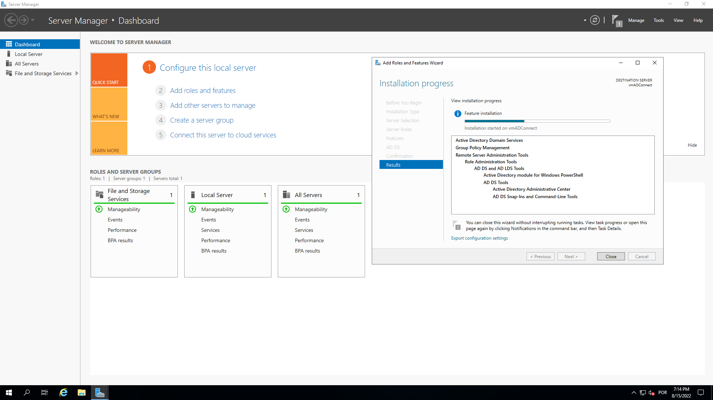

6. Selecione a opção **Promove this server to a domain controller**. 

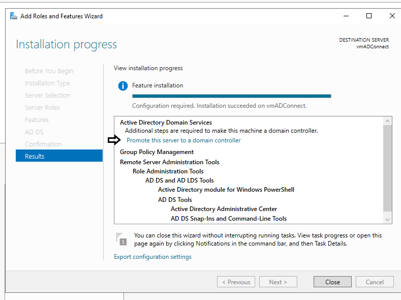

7. Uma nova janela será aberta. O próximo passo é criar uma nova foresta. Na aba **Deployment Configuration** selecione a opção **Add a new forest**, escolha um nome para seu domínio como o exemplo abaixo, e selecione **Next**.

   | Configurações | Valores |
   |  -- | -- |
   |Root domain name| suaempresa.local|

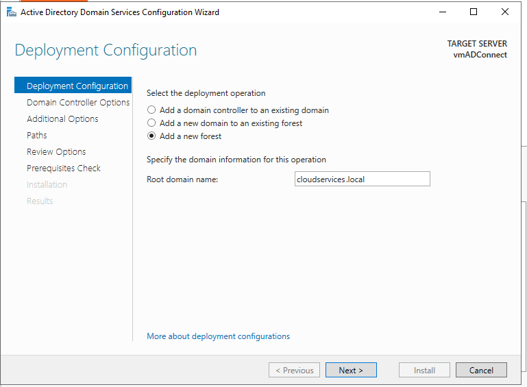

8. Na aba **Domain Controller Options** defina sua senha de restauração ou use a do exemplo abaixo.
     >**Nota**: A senha deve conter caracteres alfanuméricos e caracteres especiais.

   | Configurações | Valores |
   |  -- | -- |
   |Password| **Pa$$w0rd1234**|
   |Confirm password| **Pa$$w0rd1234**|


9. Selecione **Next** até a aba **Additional Options**. Verifique e guarde a **NetBIOS domain name**, ela será usada como prefixo do username quando acessar a maquina novamente pelo domain controller. e selecione **Next**. 


10. Selecione **Next** até a aba **Prerequisites Check** e selecione **Install**. 

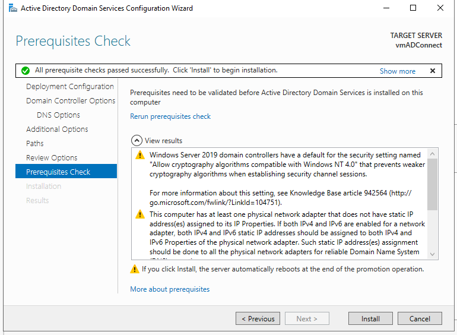

11. Após instalação ser concluída, a máquina será reiniciada.

 >**Nota**: a máquina irá reiniciar algumas vezes aguarde uns 5 minutos para acessá-la novamente.

# Task 4: Criar conta do administrador na nuvem

1. Nessa tarefa, será criado o usuário responsável pela conexão do AD Connect pelo lado do Azure Active Diretory.

2. Abra o cloud shell. Conecte ao Azure AD e obtenha seu dominio. 

 **Cloud Shell** 
  ```powershell
#Conectando ao Azure AD  
Connect-AzureAD 
#Obtendo o domínio do tenant  
Get-AzureADTenantDetail
   ```

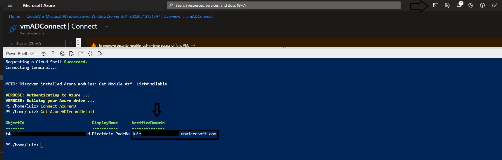 

>**Nota**: Guarde a informação da coluna **VerifiedDomain**, essa informação será usada para criação do novo usuário  e também como a UPN roteavél que será usada posteriormente no ambiente local.


3. Crie o usuário. Copie o código abaixo para um bloco de notas e altere o domínio na variável **$userPrincipalName** adicionando o dominio do seu tenant. Em seguida, copie e cole no **Cloud Shell**.

 **powershell** 
  ```powershell
$displayName = "AdminCloud"
$PasswordProfile = New-Object -TypeName Microsoft.Open.AzureAD.Model.PasswordProfile
$PasswordProfile.Password = "Pa$$w0rd1234"
$userPrincipalName = "admincloud@<VerifiedDomain>"
$mailNickName = "AdminCloud"

New-AzureADUser -DisplayName $displayName `
-PasswordProfile $PasswordProfile `
-UserPrincipalName $userPrincipalName `
-AccountEnabled $true `
-MailNickName $mailNickName
   ```


### Adicionar a função Global Administrator ao usuário criado

1. O próximo passo é assinalar a função de **Global Administrator** para esse usuário.

Execute o comando a seguir:


 **powershell** 
  ```powershell
#Conectar ao Azure AD
Connect-AzureAD 

#Exemplo id do usuário do AAD
$objectIdUsuario = (Get-AzADUser -Filter "DisplayName eq 'AdminCloud'").id

#Exemplo id da Função Habilitada do AAD
$ObjectIdRole = (Get-AzureADDirectoryRole | Where-Object {$_.DisplayName -eq "Global Administrator"}).ObjectId

Add-AzureADDirectoryRoleMember -ObjectId $ObjectIdRole -RefObjectId $objectIdUsuario

   ```
   
# Task 5: Acessar o Domain Controller e criar sua estrutura organizacional.

1. Volte à máquina que está seu Domain Controller.

2.  No aba **Overview** da máquina virtual, clique no botão **Connect** e escolha **RDP** na lista suspensa.

    

 
3. No aba **Connect** da máquina virtual, mantenha as opções padrão para conectar-se ao endereço IP público pela porta 3389 e clique em **Download RDP File**. Um arquivo será baixado no canto inferior esquerdo da tela.

4. **Abra** o arquivo RDP baixado (localizado na parte inferior esquerda de sua máquina de laboratório) e clique em **Connect** quando solicitado.

    

5. Na janela **Segurança do Windows**, clique em **Mais opções** e em seguida em **Usar uma conta diferente**. No campo do nome do usuário, coloque o prefixo **NetBIOS domain name** guardado anteriormente seguindo pelo nome do usuário e a senha **Pa$$w0rd1234**.
    >Nota: Como irá acessar o domain controller é necessário acrescentar **NetBIOS domain name** antes do nome do usuário.

   | username      | senha        | 
   |  --        | --              | 
   | suaempresa/admimseunome  | Pa$$w0rd1234|
  
 

6. Você pode receber um certificado de aviso durante o processo de entrada. Clique em **Sim** ou para criar a conexão e conectar-se à sua VM implantada. Você deve se conectar com sucesso.

    


7. Após logado, em seu domain controller, dentro da console **Server Manager** selecione a aba **Tools** e selecione **Active Directory Users and Computers**.

 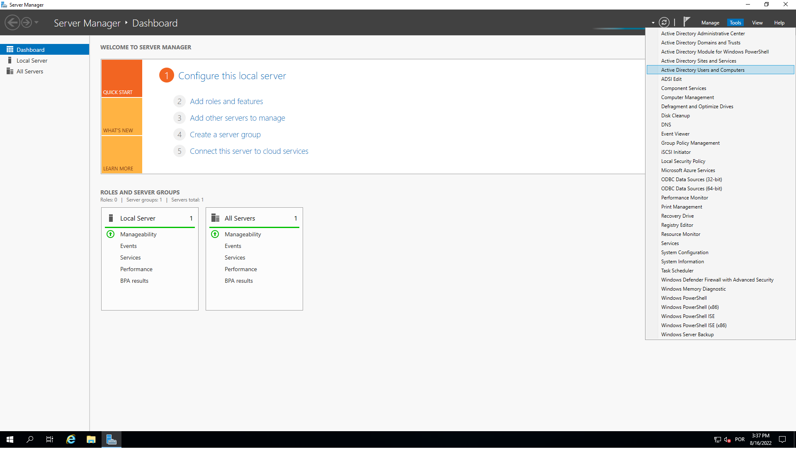

8. Dentro da janela do seu domain controller, clique com o botao direito em cima do seu dominio, selecione **New**, em seguida em **Organizacional Unit**

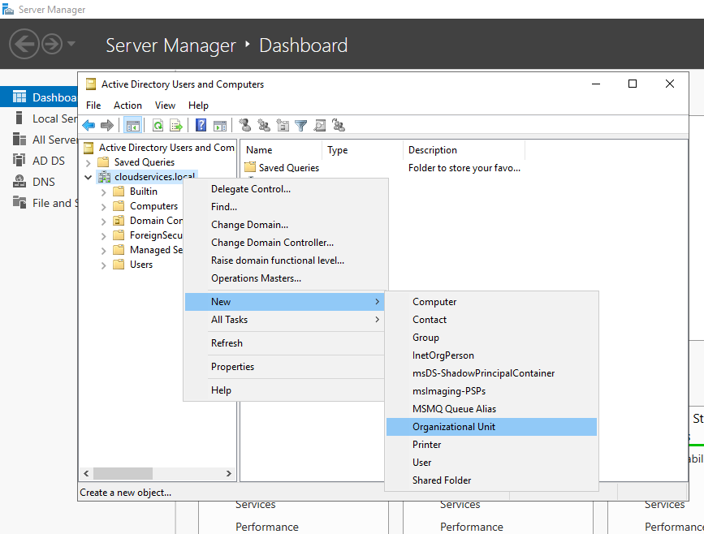

9. Primeiramente iremos criar uma **Organizacional Unit( OUs)** chamada **Suporte**, que irá representar o departamento de **Suporte** de sua organização. Nessa nova janela digite **Suporte** e selecione o botão **OK**.


 >**Nota**: Note que a pasta **Suporte** foi criada.


10. Repita os passos 8 e 9 para criar as **OUs** para o departamentos: Diretoria, Comercial e Financeiro.

11. Ao final da criações seu ambiente estará assim:


12. Os próximos passos é criar os usuários. Clique com o botão direito em cima de cada pasta criada, selecione **New**, em seguida **User**. No exemplo abaixo criamos um usuario dentro da OU Suporte.

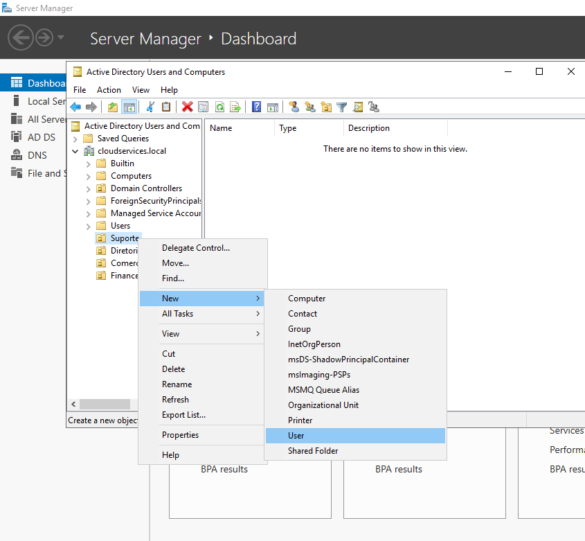

13. No campo **User login name**, coloque o nome desejado, ou o nome conforme na figura abaixo e selecione **Next**.

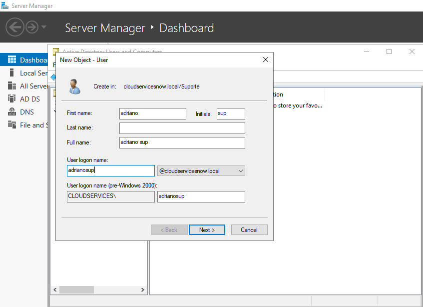

14. Crie a senha do novo usuário e selecione **Next**, em seguida **Finish**

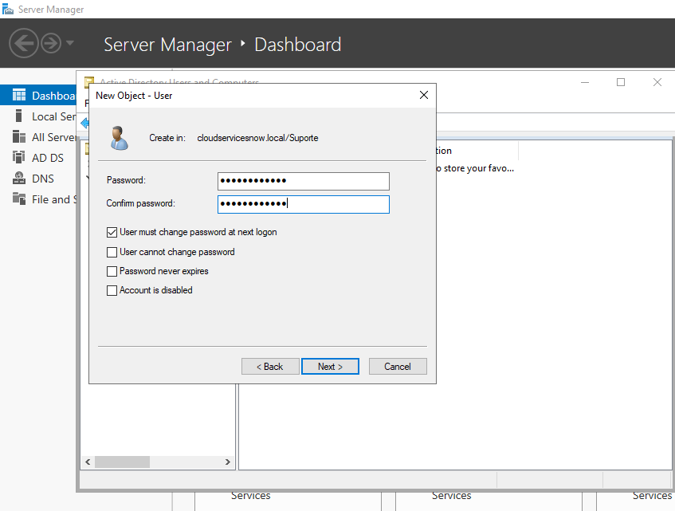

15. Crie pelo menos um usuario em cada OU.

16. Agora vamos criar um grupo dentro duas OUs. Nesse lab iremos usar como exemplo: **Suporte** e **Diretoria**. 

17. Clique com o botão direito em cima da pasta **Suporte**, selecione **New**, em seguida **Group**.

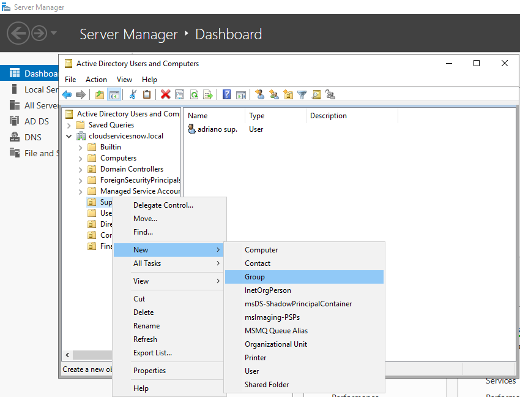

18. Insira um nome para o grupo e mantenha as configurações conforme a figura abaixo e em seguida clique em **OK**.


19. Agora vamos inserir o usuário dentro do grupo. Faça um duplo em cima do grupo, irá abrir um nova janela. Vá até a aba **Members** e selecione o botão **Add**.


20. Digite o nome do usuário pertecente a essa unidade, selecione **Check Names**, verifique se está correto e  selecione **OK**, em seguida **Apply** e **OK**.


21. Repita os passos 17 a 20 para a OU **Diretoria**.

22. A sua estrutura organizacional deve ser similar a tabela abaixo:

| OUs       | Grupos          | Usuários |
|  --        | --              | --       |
| Suporte    | GG_Suporte      | Adriano sup |
| Diretoria  | GG_Diretoria    | Maria dir |
| Comercial  |                 | Felipe com |
| Financeiro |                 | Ana fin |

# Task 6: Criar um usuário administrador local

Nessa tarefa, iremos criar um usuário com as mesmas permissões que o usuário principal, para que seja responsável pela autorização da conexão do lado do ambiente local.

1. Selecione a a pasta **Users**, clique com o botão direito do mouse em cima do usuário **adminseunome**, e selecione **Copy**


2. Na janela **Copy Object - User**, crie um novo usuário semelhante a imagem abaixo e clique em **Next**.


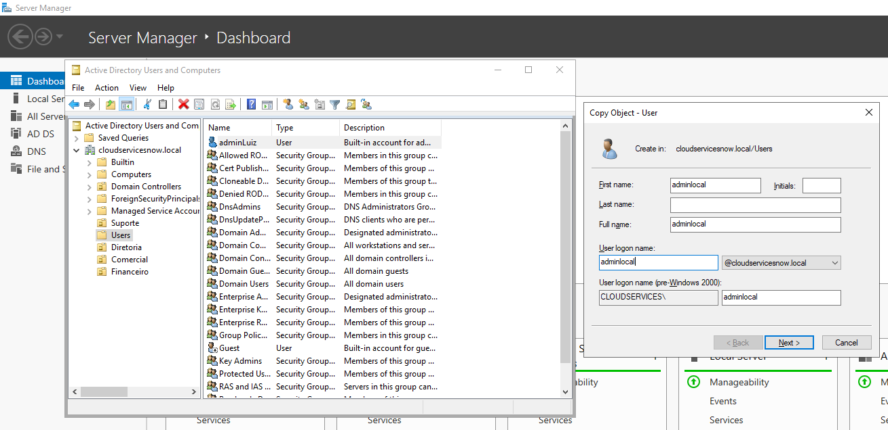

3. Digite a senha do novo usuário, e selecione **Next** em seguida **Finish**.

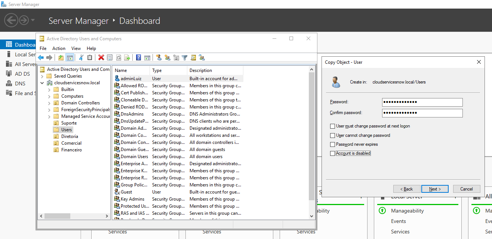

4. Editar usuário
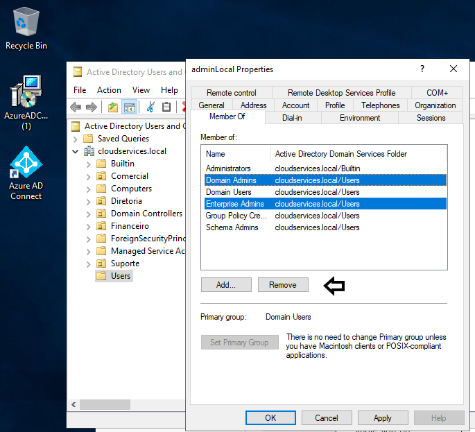

# Task 7: Sincronizar o ambiente local com o Azure AD

1. Volte a portal, e acesse o Azure Active Directory. Selecione a aba **Azure AD Connect**, em seguida selecione o link **Download Azure AD Connect**. 
 
 


2. Na página de download baixe o executável.

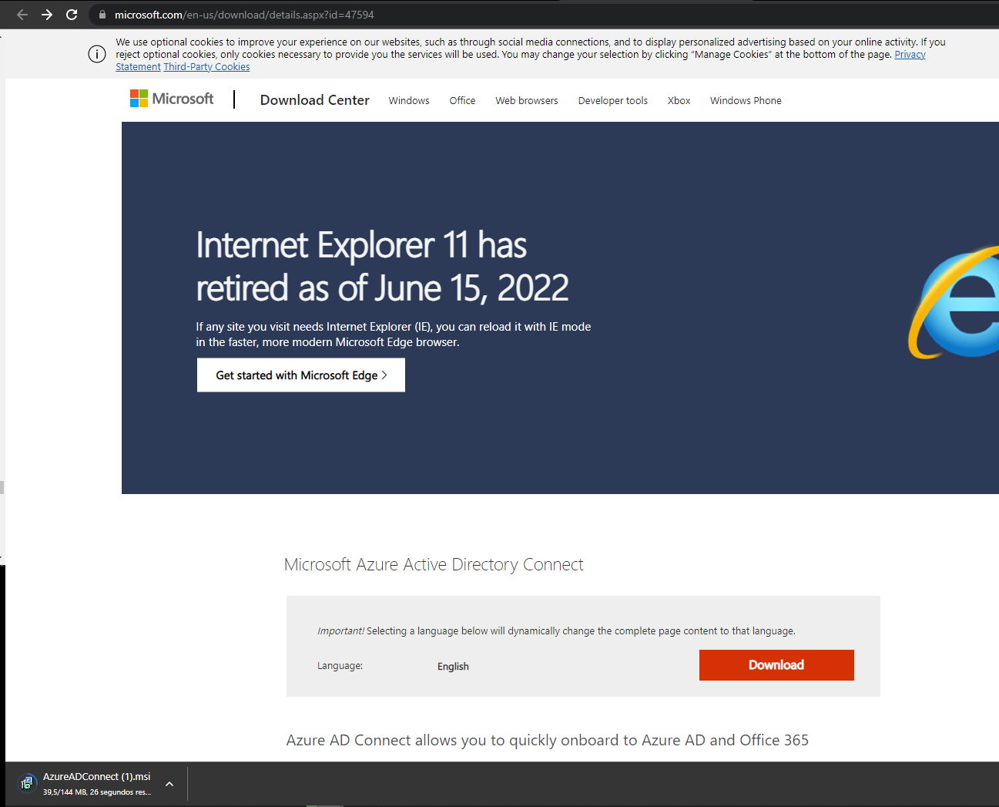 

3. Após o download copie o arquivo para dentro da máquina que está o Domain Controler.

 

 

4.  Volte ao portal. Ainda na aba **Azure AD Connect**, em **HEALTH AND ANALYTICS** selecione  **Azure AD Connect Health**. Em seguida faça o download do **Azure AD Connect Health agent for AD DS.**

5. Após o donwload copie o arquivo para dentro da máquina que está o domain controler.

6. No seu domain controller, execute o instalador do Azure AD Connect.

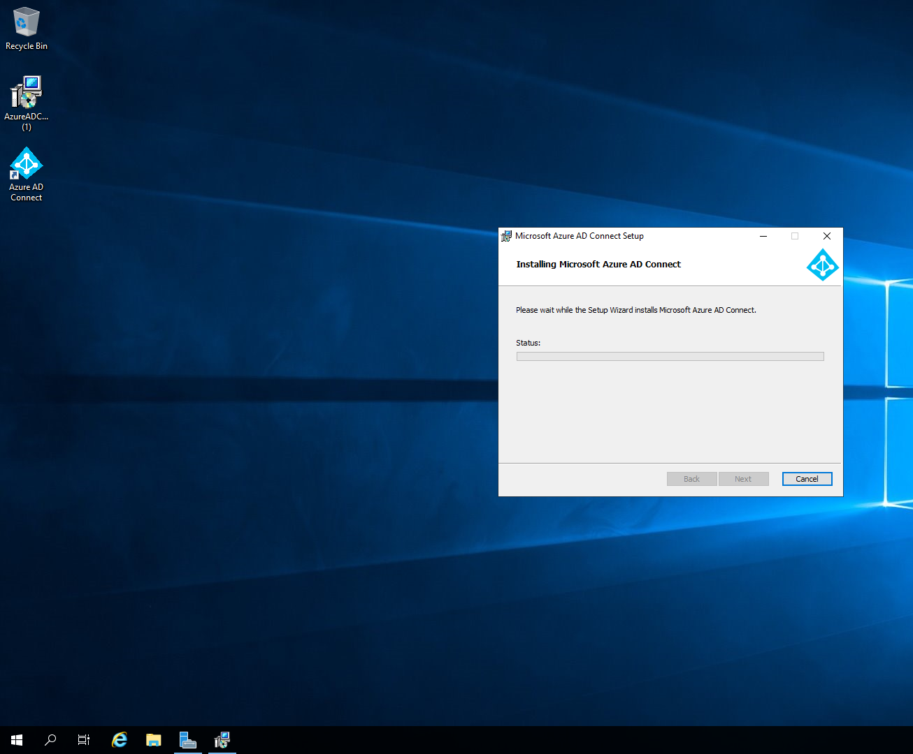 

7. Na tela de boas vindas do AD Connect, aceite os termos e noticias de privacidade e selecione o botão **Continue**.

8. Na aba, **Express Settings**, verifique que possui a mensagem que o dominio com o sufixo **.local** não é roteavel. Para resolver esse problema é preciso configurar a UPN para um dominio roteável. Feche a janela.

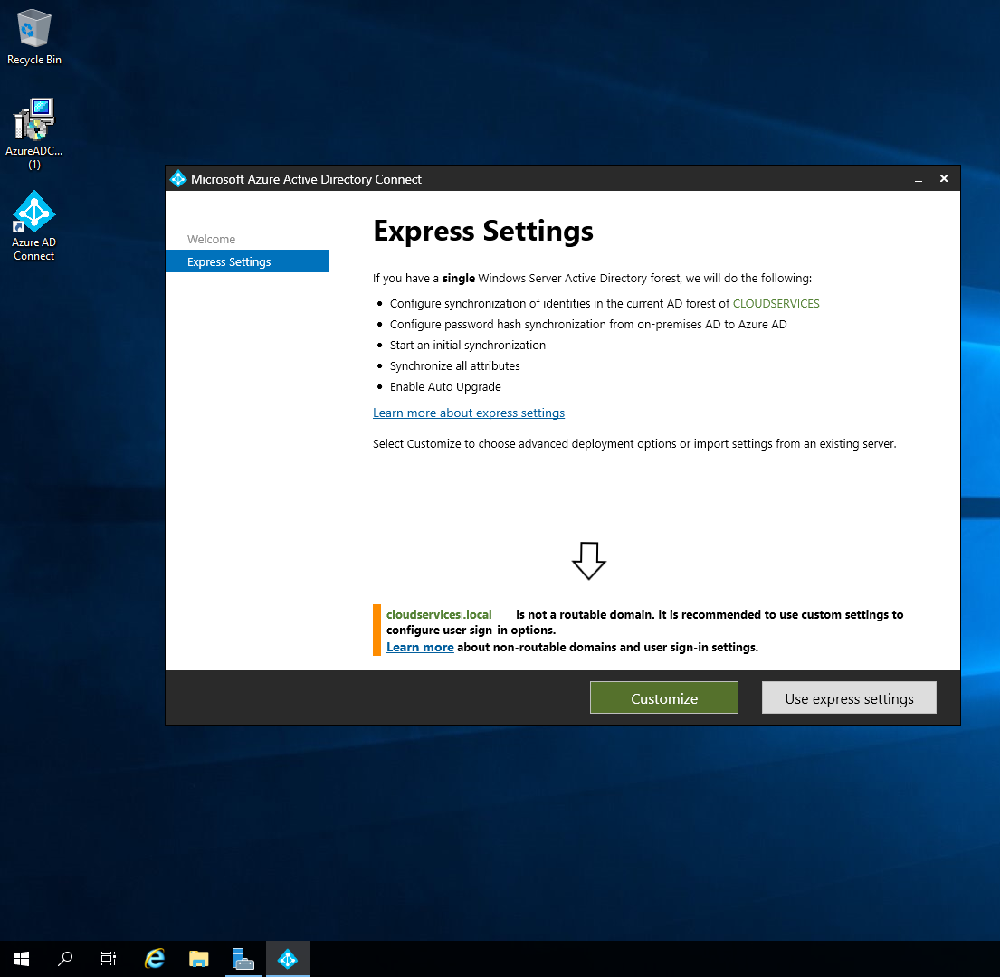 


9. Vá para console **Server Manager**, selecione a aba **Tools** e clique em **Active Directory Domain and Trusts**.

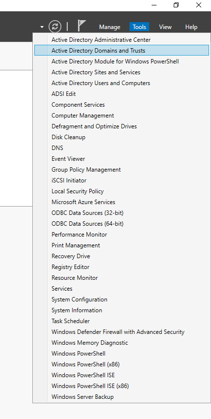 

10. Clique com o botão direito em cima da pasta **Active Directory Domain and Trusts**, selecione **Properties**.

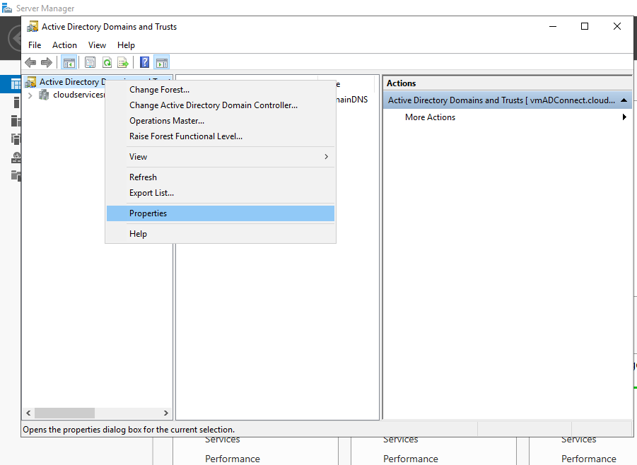 

11. Adicione o novo sufixo(domínio) que foi guardado da Task 3, passo 2 (VerifiedDomain). Clique em **OK**.


>Nota: Por simular um ambiente que foi configurado com a UPN **.local** todos os usuarios criados receberam essa UPN. Entretando para sincronizar com o Azure AD é necessário mudar as UPN de todos os usuários para uma que seja roteável. Caso essa tarefa não seja executada irá acarretar problemas no sincronismo.

12. Retorne ao console **Server Manager** selecione a aba **Tools** e selecione **Active Directory Users and Computers**.

13. Abra as **OUs**, entre nas propriedades dos usuários, capture o **User logon name** na aba **Account**, e guarde-os em um bloco de notas. Vá na pasta **User** e faça o mesmo com o usuario **adminlocal**.

>Obs: Esse dado dos usuários será necessário para a troca de suas UPNs.


14. Clique no icone de **Lupa** no canto inferior esquerdo, e digite no  campo de pesquisa **Powershell** e abra o **Powershell**.

15. Para alterar o UPN de todos os usuários em uma só vez execute o código abaixo. Popule a lista **usuario** abaixo com o **User logon name** do usuários criados nas OUs. A variável **upnNova** irá receber o novo sufixo adicionado. 


 **powershell** 
  ```powershell
#Exemplo

Import-Module ActiveDirectory

$usuario = @("adminlocal", "mariadir","felipecom","anafin","adrianosup")
$upnNova = <VerificiedDomain>

for($i=0; $i -lt $usuario.Count;$i++){


$newUserPrincipalName = $usuario[$i]+$upnNova

$User = Get-ADUser -Identity $usuario[$i] -Properties userPrincipalName
$User.userPrincipalName = $newUserPrincipalName

Set-ADUser -Instance $User
}


   ```

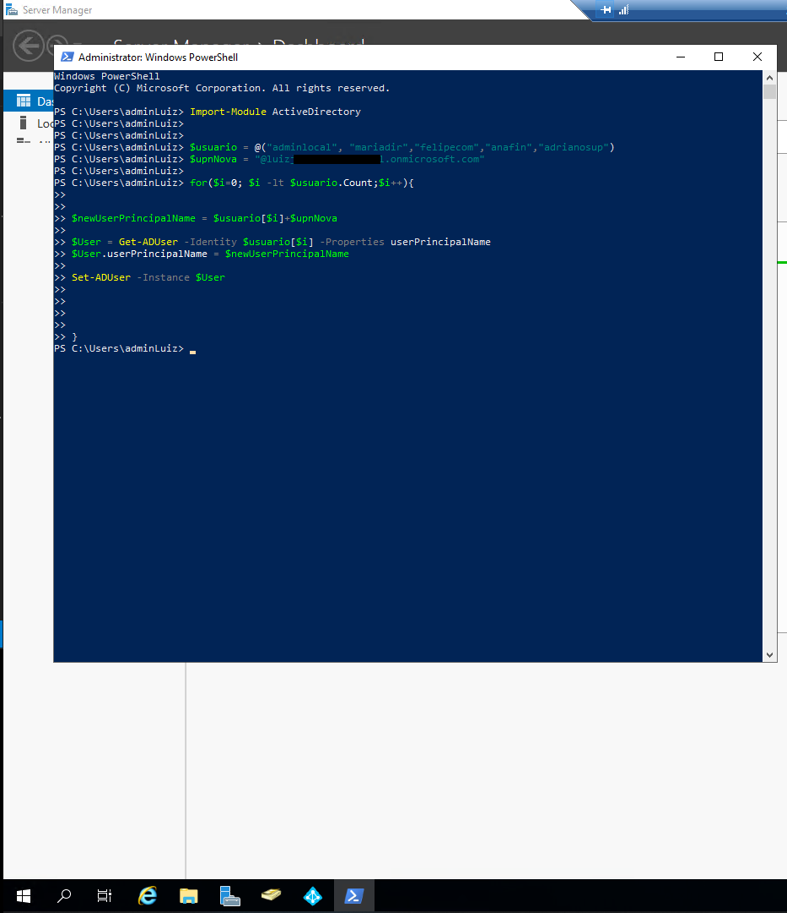

16. Minimize a janela do **Powershell** e volte a janela do AD Connect ou abra o atalho do AD Connect na Área de trabalho, e na aba **Express Setings**, selecione o botão **Customize** 


>Observação: Repare que a mensagem em relação a upn continua, porém como já preparamos o ambiente, iremos tratar esse problemas mais a frente.

17. Na aba **Required Components**, configure conforme a imagem abaixo, selecione o botão **Install**. Aguarde o fim da instalação.

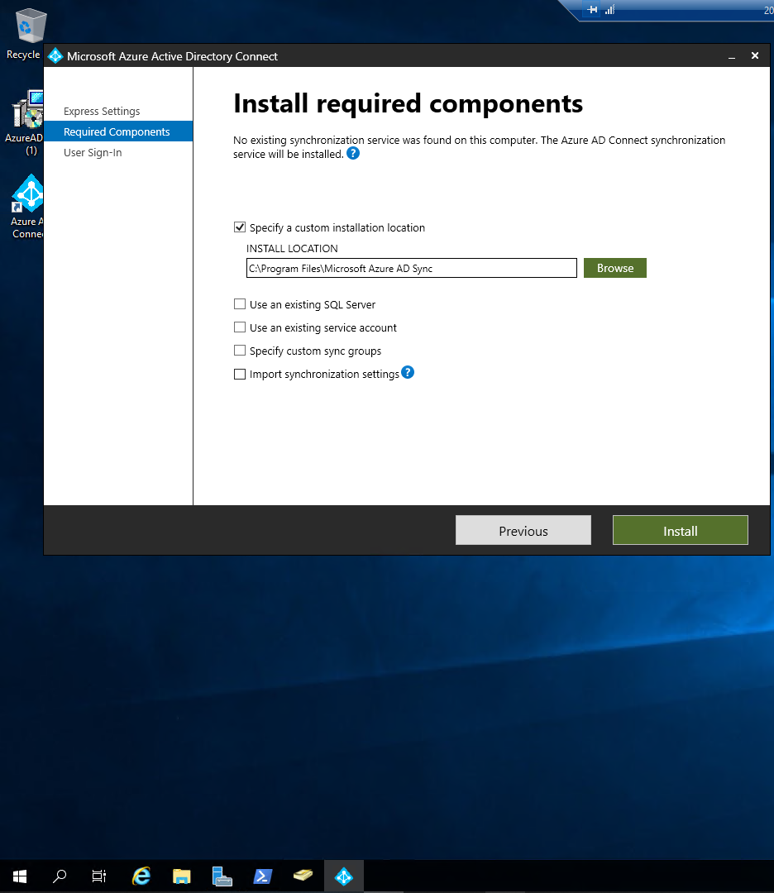

18. Na aba **User Sign In**, selecione a opção **Password Hash Synchonization** e habilite o **single sign-on**, em seguida clique em **Next**.


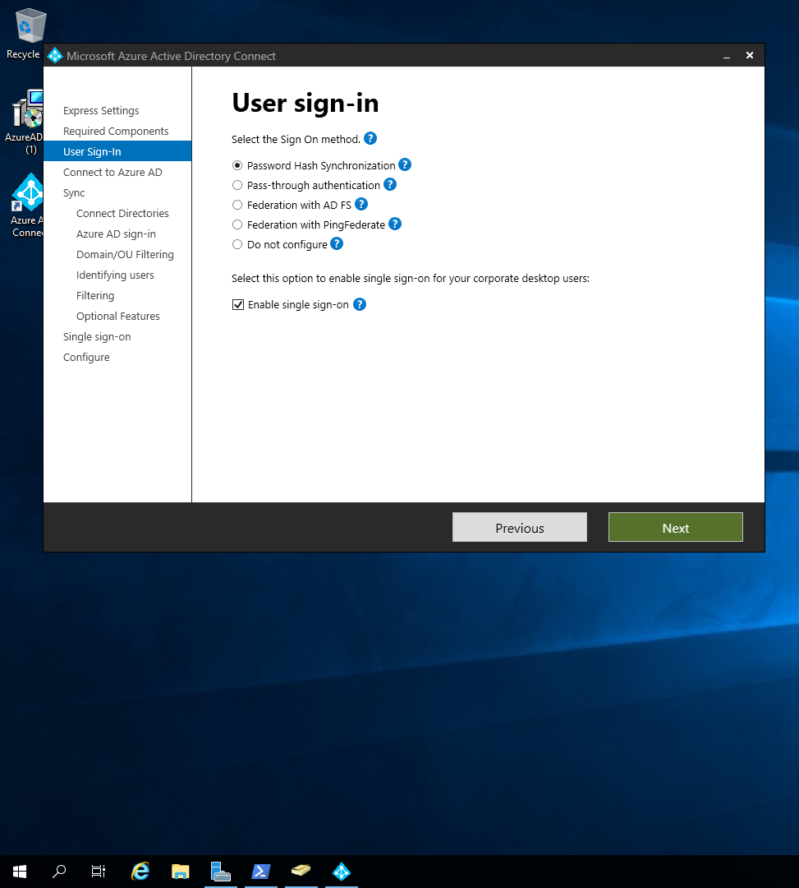

19. A próxima etapa é conectar ao Azure AD, antes precisamos desabilitar o **IE Enhanced Security Configuration**, para que a conexão a Internet seja liberada. Abra o **Server Manager**, na aba Local Server, clique na propriedade **IE Enhanced Security Configuration** e desabilite como na figura abaixo.

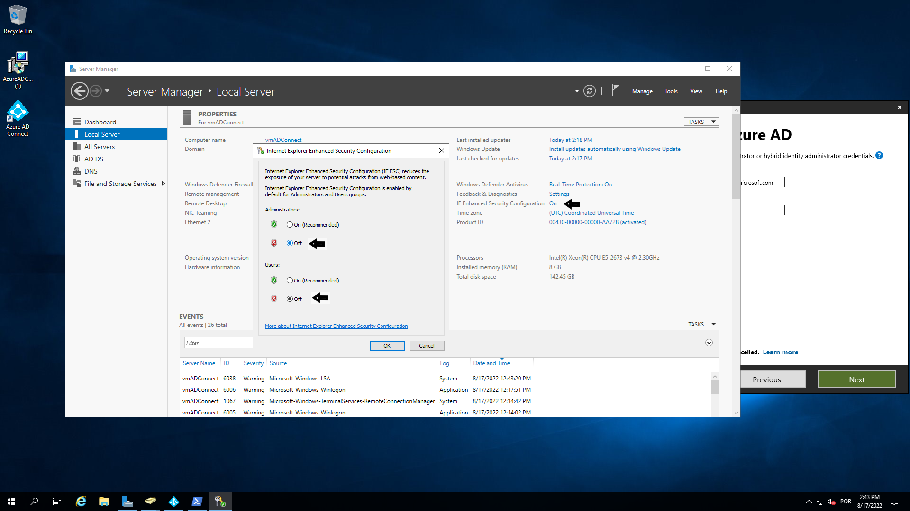

20. Na aba **Connect to Azure AD**, coloque as crendenciais do usuário criado no seu tenant na **Task 3**, em seguida clique em **Next**.

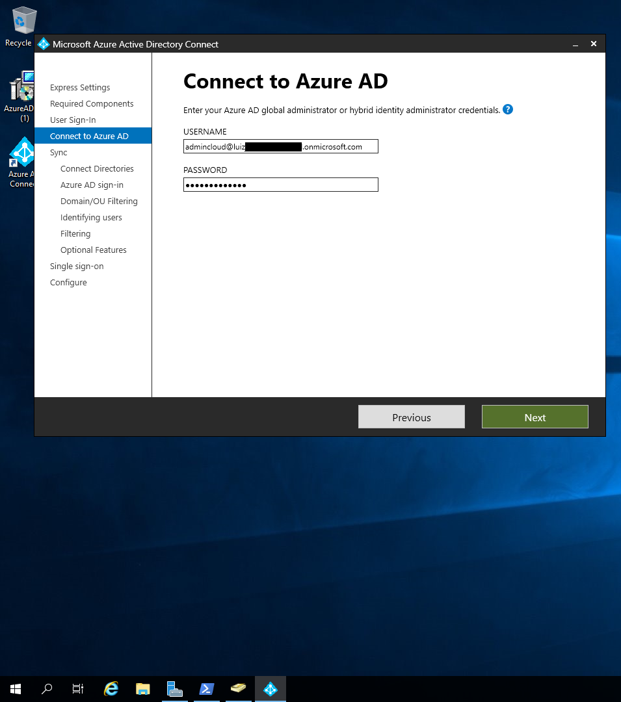


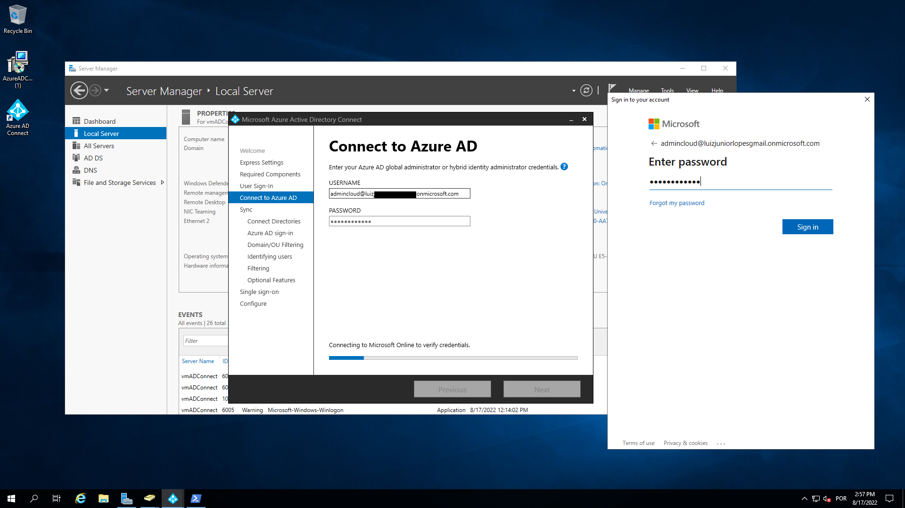

21. Na aba **Connect Directories**, deve ser adicionado o diretório que será sincronizado. Clique em **Add Directory**. Coloque a credenciais do administrator local.


22. Na janela **AD forest account**, marque a opção **Use existing AD account** e entre com as credenciais do usuario criado na **Task 5** em domain controller. Em seguida clique em **OK** depois **Next**


23. Na aba **Azure AD sign-in**, marque a caixa **Continue without matching all UPN suffixes to verifed domais**. Clique em **Next**.
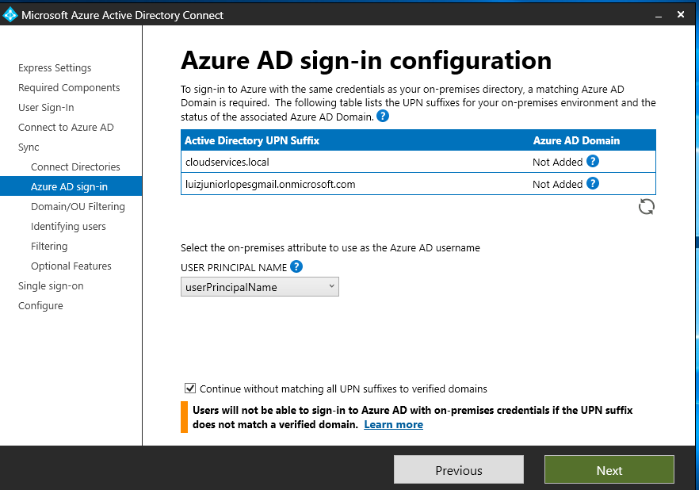

24. Na aba **Domain and OU filtering**, marque a opção **Sync select domains and OUs**, e selecione as OU's criadas nesse lab: **Diretoria, Comercial, suporte e Financeiro**. Clique em **Next** até a aba **Filtering**.

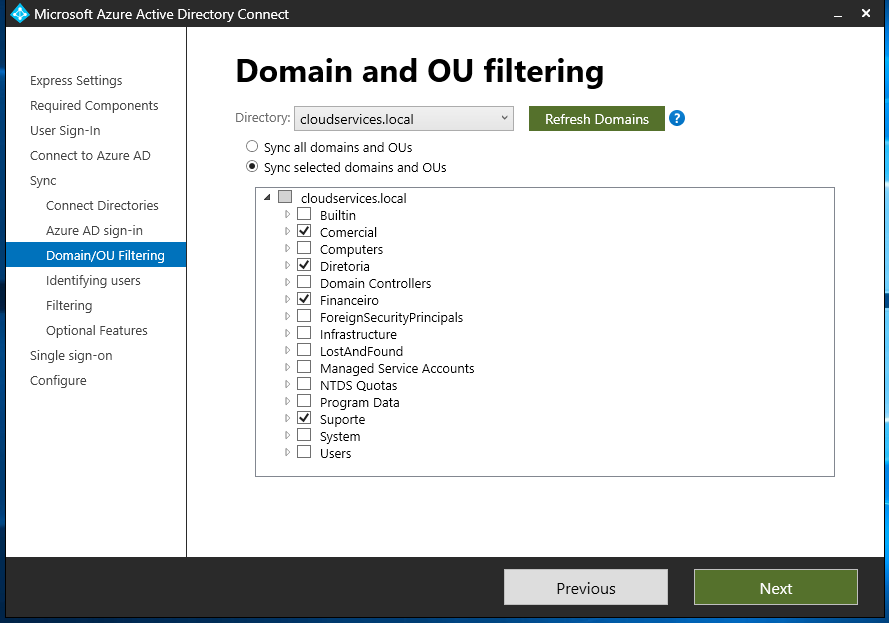

25. Na aba **Filtering**, há opção de sincronizar apenas usuários e dispositovos vinculado a um grupo, porém nesse lab, iremos sincronizar todos os usuários criados. Clique em **Next**.

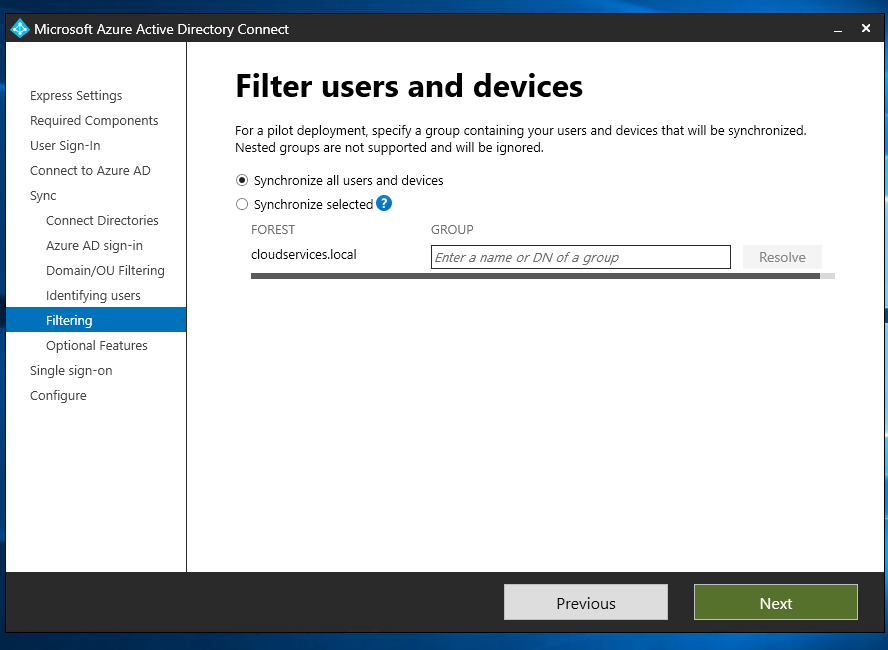


26. Na aba **Optional Features**, verifique se está como a imagem abaixo. Clique em **Next**.


27. Na aba **Single sign**, autorize o logon único entre o Azure AD e seu ambiente local. Clique em **Enter Credentials** e coloque as credenciais de administrador. Após esse processos, clique em **Next**.


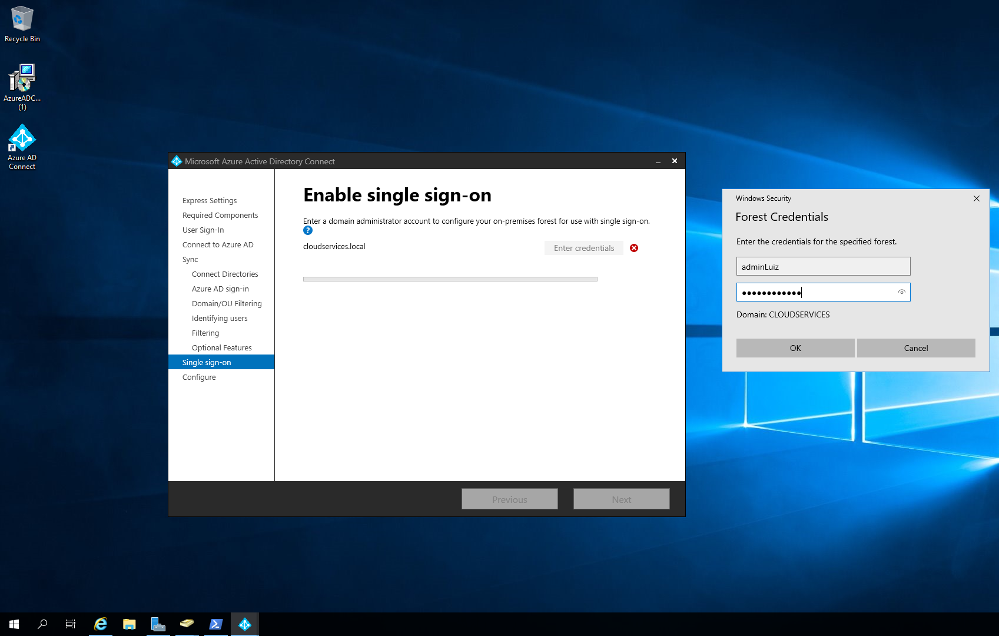

>Nota: O username e a senha usadas acima são as credenciais criadas no incio do lab pra entrar na máquina virtual.

28. Na aba **Configure**,  clique em **Install**.


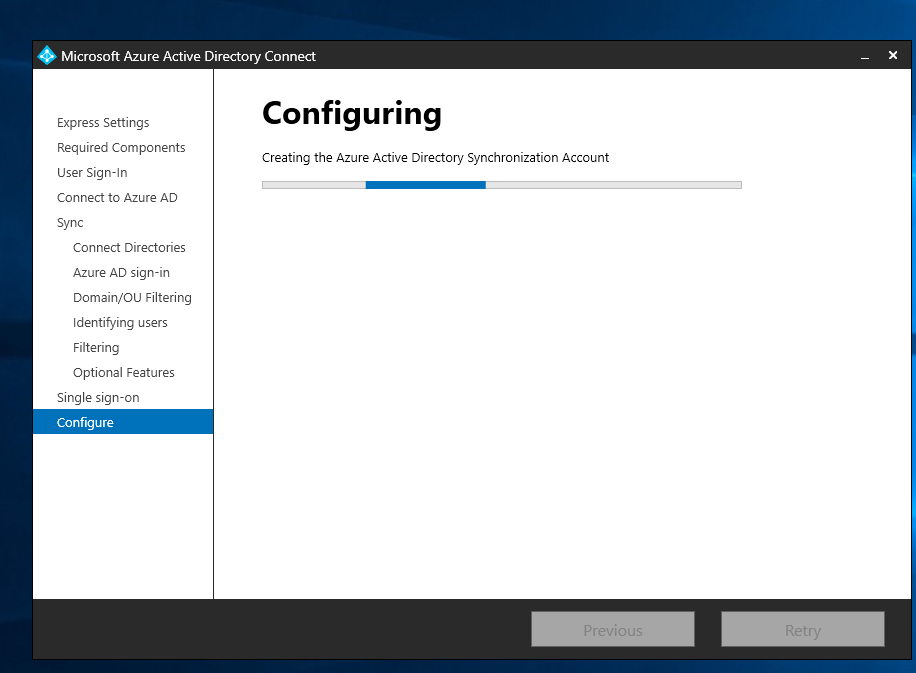

29. Aguarde o fim da configuração do sincronismmo.
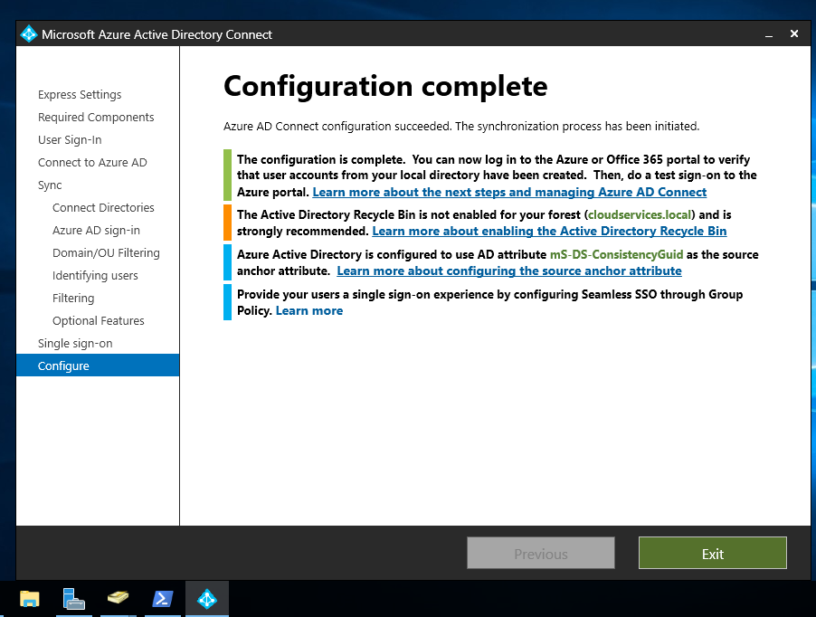

30. Abra o portal do Azure, na área de pesquisa digite Azure Active Directory.

31. Na aba Users, Verfique se os usuarios foram adicionados a partir da sincronização.

32. Parabéns, a conexão entre o AD e ADD foi estabelicida a partir do ADConnect.


#### Revisão

Nesse laboratório, você aprendeu:

+ Criar a máquina virtual
+ Conecte-se à máquina virtual
+ Criar Domain Controller
+ Criar conta do administrador na nuvem
+ Acessar o Domain Controller e criar sua estrutura organizacional.
+ Criar um usuário administrador local
+ Sincronizar o ambiente local com o Azure AD


