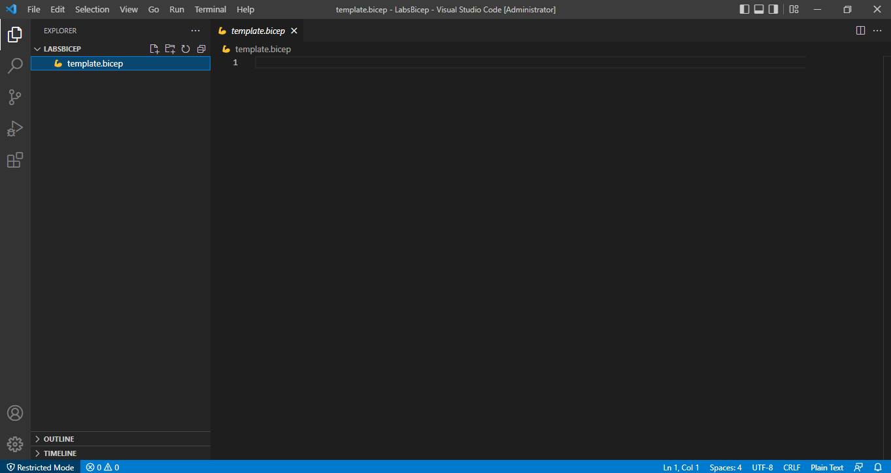

# Lab 2.1.4 - Criando e configurando uma conta de armazenamento com Bicep do Azure

## Preparando o ambiente para o Bicep no PC local

Você pode usar o Azure PowerShell ou o CLI do Azure para implantar um recurso com Bicep. Nesse Lab iremos utilizar o CLI.

Caso não tenha o CLI do Azure no PC Local siga os passos abaixo:


### Instalando Cli do Azure no PC Local a partir do powershell

Você também pode instalar a CLI do Azure usando o PowerShell.

### Abra o powershell como administrador

Execute o comando a seguir:

 **powershell** 
  ```powershell
   $ProgressPreference = 'SilentlyContinue'; Invoke-WebRequest -Uri https://aka.ms/installazurecliwindows -OutFile .\AzureCLI.msi; Start-Process msiexec.exe -Wait -ArgumentList '/I AzureCLI.msi /quiet'; rm .\AzureCLI.msi
   ```

Isso baixará e instalará a versão mais recente da CLI do Azure para Windows. Se você já tiver uma versão instalada, o instalador atualizará a versão existente.

Para instalar uma versão específica, substitua o argumento ```-Uri```  pelo ```https://azcliprod.blob.core.windows.net/msi/azure-cli-<version>.msi```, colocando a versão desejada no campo **\<version>**. As versões disponíveis podem ser encontradas nas [notas de versão da CLI do Azure](https://docs.microsoft.com/en-us/cli/azure/release-notes-azure-cli) 

**Obs:** Para utilizar o módulo do CLI após a instalação, feche e abra novamente o powershell como administrador.

## Instalar ferramentas do Bicep

O Azure PowerShell não dá suporte à implantação de arquivos Bicep remotos. Então será necessário que tenha o aquivo em seu pc local.

Para criar arquivos Bicep, você precisará de um bom editor de Bicep. Recomendações:

+ **Visual Studio Code** - Se você ainda não tiver o Visual Studio Code, [instale-o](https://code.visualstudio.com/).

+ **Extensão do Bicep para o Visual Studio Code** - O Visual Studio Code com a extensão do Bicep fornece suporte a idiomas e preenchimento automático de recursos. A extensão ajuda a criar e validar arquivos Bicep.

Para instalar a extensão, pesquise bicep na guia Extensões. Selecione **Instalar.**


## Ambiente de implantação

Depois de configurar seu ambiente de desenvolvimento, você precisa instalar a CLI do Bicep para seu ambiente de implantação. Dependendo se você deseja usar a CLI do Azure ou Azure PowerShell, as etapas para configurar um ambiente de implantação local são diferentes. Nesse laboratório iremos configurar com o CLI. Caso queira utilizar o powershell, acesse [Instalar ferramentas do Bicep](https://docs.microsoft.com/pt-br/azure/azure-resource-manager/bicep/install#windows)

Você deve ter a CLI do Azure versão 2.20.0 ou mais recente instalada.

Para verificar sua versão atual, execute:

 **powershell** 
  ```
   az --version
   ```

Instale o CLI do Bicep:

**powershell** 
  ```
   az bicep install
   ```

Para atualizar para a versão mais recente, use:

**powershell** 
  ```
   az bicep upgrade
   ```

Para validar a instalação, use:

**powershell** 
  ```
   az bicep version
   ```

## Estruturando arquivo para implantação

Agora vamos criar a estrutura que será utilizada no Vscode para a implatação.

Vamos criar a pasta que ficará o **template.bicep**.

**powershell** 
  ```powershell
   # cria uma pasta no diretório C:\
   New-Item -Path 'C:\LabsBicep' -ItemType Directory
   ```


Agora vamos criar o arquivo **template.bicep**.

**powershell** 
  ```powershell
   # cria uma pasta no diretório C:\
   New-Item -Path 'C:\LabsBicep\template.bicep' -ItemType File
   ```

Abra a pasta criada no Vscode e selecione o arquivo vazio.



Copie o código desse laboratório para esse arquivo.


## Conectando ao Storage Accounts do Azure

**Obs:** Todos comandos a seguir podem ser executados diretamente pelo terminal do Vscode.

## Faça login pelo CLI

Primeiramente faça login em sua conta usando o módulo do CLI.

Execute o comando a seguir:

 **cli** 
  ```
   az login --tenant <digite o ID do tenant>
   ```
  **Exemplo** 
  ```
   az login --tenant 11a11a11-1aa1-a11a-11a1-1111a1111a11
   ```

Uma aba de navegador abrirá para que se possa fazer o login em sua conta. faça o login, fecha a tela e volte ao terminal do powershell.

**Obs:** O valor do Tenant ID é encontrado dentro do seu diretório do Azure AD no portal. Se não colocar o tenant ID pode ocorrer erro de autorização na hora de executar os cmdlets.


Após a instalação e conexão concluídas, feche o terminal.

## Criar uma conta de armazenamento

Uma conta de armazenamento é um recurso do Azure Resource Manager. O Resource Manager é o serviço de implantação e gerenciamento do Azure. Para obter mais informações, consulte [Visão geral do Azure Resource Manager](https://docs.microsoft.com/en-us/azure/azure-resource-manager/management/overview) .
 
Cada recurso do Resource Manager, incluindo uma conta de armazenamento do Azure, deve pertencer a um grupo de recursos do Azure. Um grupo de recursos é um contêiner lógico para agrupar seus serviços do Azure. Ao criar uma conta de armazenamento, você tem a opção de criar um novo grupo de recursos ou usar um grupo de recursos existente. Este tutorial mostra como criar um novo grupo de recursos. 


Execute o comando a seguir:


 **CLI** 
  ```
   $name = "storage-account-name"
   $location = "westus"

   az group create --name $name --location $location

   ```

 
Em seguida, crie uma conta de armazenamento. 
Atualmente, o Azure PowerShell não dá suporte à implantação de arquivos Bicep remotos. Então será necessário que copie os conteudo do arquivo "template.bicep" para seu computador local. Abra um bloco de notas, copie o conteúdo e salve-o com o mesmo nome do arquivo desse laboratório. Preencha a variável **$templateFile** com o caminho do arquivo.

Execute o comando a seguir:


 **powershell** 
   ```powershell
   #escolha um nome para seu resource-group
   $resourceGroup = "resource-group"
   #Verique o caminho do seu arquivo e coloque aqui.
   $templateFile = "C:\LabsBicep\template.bicep"

   az deployment group create --resource-group $resourceGroup --template-file $templateFile

   ```

## Deletar uma conta de armazenamento

A exclusão de uma conta de armazenamento exclui a conta inteira, incluindo todos os dados da conta. Certifique-se de fazer backup de todos os dados que deseja salvar antes de excluir a conta.
 
Sob certas circunstâncias, uma conta de armazenamento excluída pode ser recuperada, mas a recuperação não é garantida. Para obter mais informações, consulte  [Recuperar uma conta de armazenamento excluída](https://docs.microsoft.com/en-us/azure/storage/common/storage-account-recover) .
 
Se você tentar excluir uma conta de armazenamento associada a uma máquina virtual do Azure, poderá receber um erro sobre a conta de armazenamento ainda estar em uso. Para obter ajuda para solucionar esse erro, consulte  [Solucionar erros ao excluir contas de armazenamento](https://docs.microsoft.com/en-us/troubleshoot/azure/virtual-machines/storage-resource-deletion-errors) .


Para excluir a conta de armazenamento, execute o comando a seguir:


 **powershell** 
  ```
   $name = "storage-account-name"
   $resourceGroup = "resource-group"

   az storage account delete --name $name --resource-group $resourceGroup
   ```

Caso deseje deletar o grupo de recurso, execute o comando abaixo.

  **powershell** 
  ```
   $name = "resource-group-name"
  
   az group delete --name $name
   ``` 

Quando se deleta o grupo de recursos, todos os recursos contidos nele são deletados. Ao fazer esse processo se certifique que todos o s recursos podem ser excluídos. Caso contrário, exclua-os individualmente. 

   

#### Revisão

Nesse laboratório, você aprendeu:

+ Preparando o ambiente para o Bicep no PC local
+ Instalar ferramentas do Bicep
+ Criar um ambiente de implantação para  o Bicep do Azure
+ Estruturar um arquivo Bicep para implantação
+ Conectar ao Azure Storage Accounts
+ Criar uma conta de armazenamento
+ Deletar uma conta de armazenamento


#### Referências

+ https://docs.microsoft.com/pt-br/azure/azure-resource-manager/bicep/install#windows

